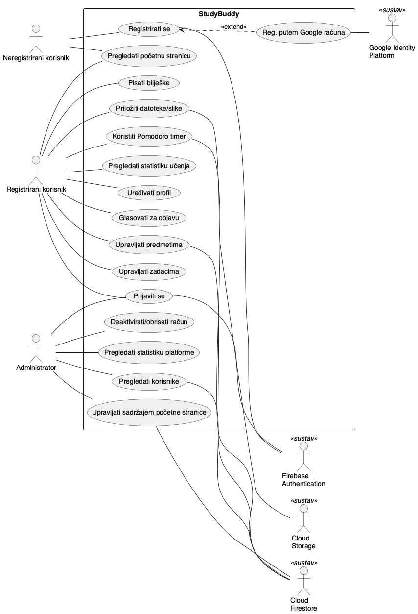
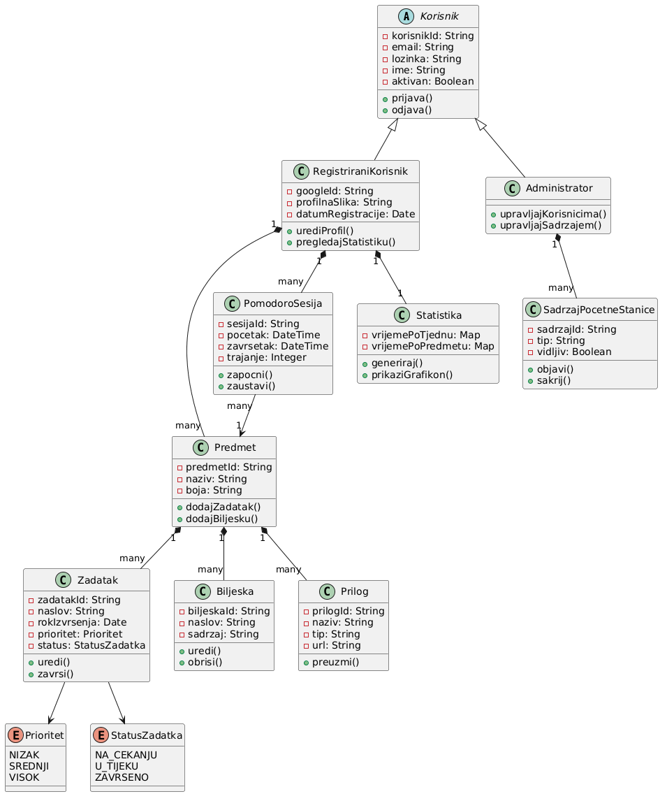
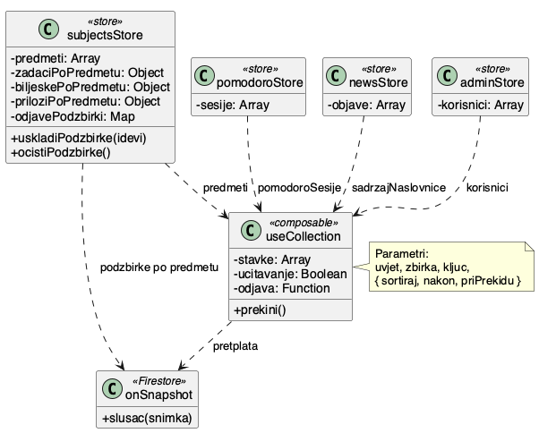
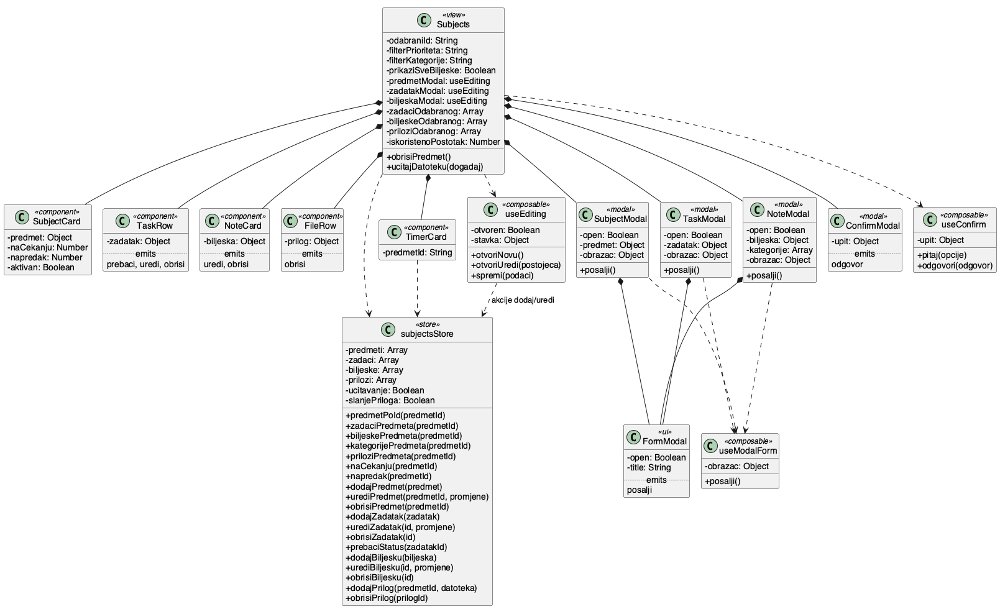
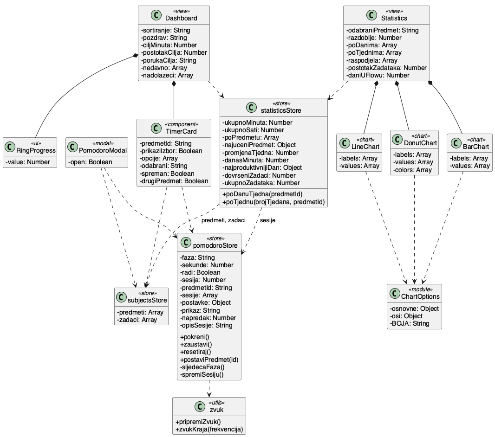
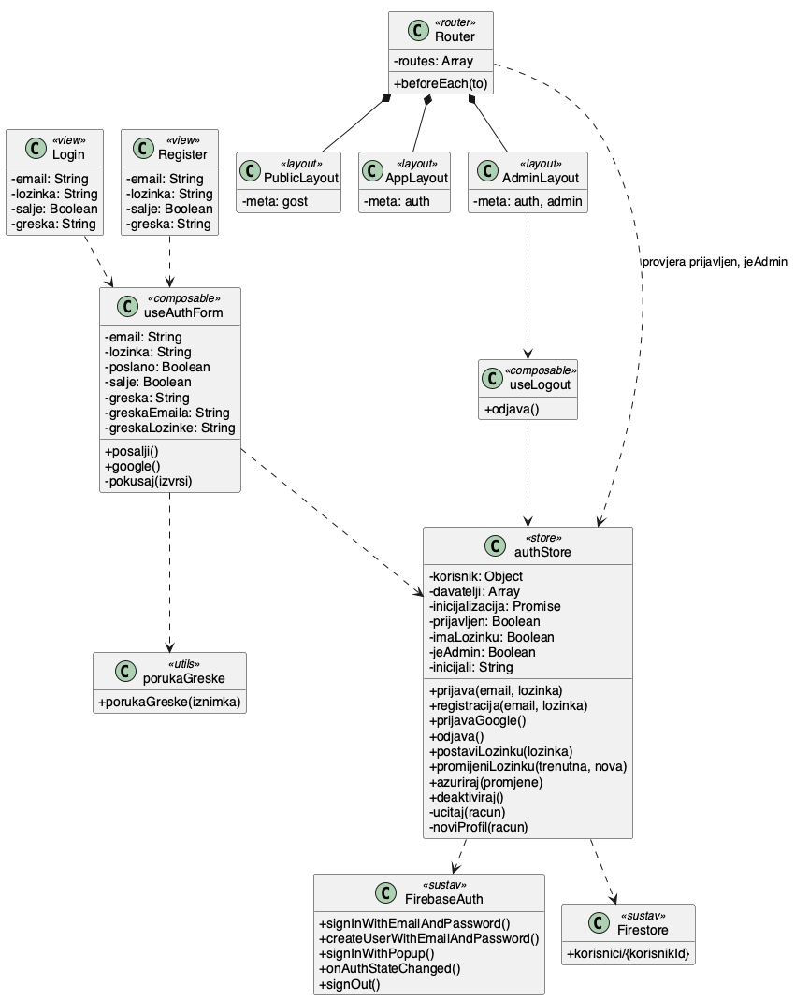
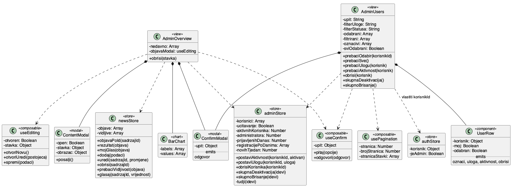

# StudyBuddy

### Projektna dokumentacija

**Kolegij:** Programsko inženjerstvo
**Mentor:** doc. dr. sc. Nikola Tanković
**Autor:** Marko Kovač
**Ustanova:** Fakultet informatike u Puli, Sveučilište Jurja Dobrile u Puli
**Repozitorij:** https://github.com/markokovac16/study-buddy

Pula, 2026.

<div style="page-break-after: always"></div>

## Sadržaj

1. [Sažetak](#1-sažetak)
2. [Uvod i motivacija](#2-uvod-i-motivacija)
3. [Razrada funkcionalnosti](#3-razrada-funkcionalnosti)
4. [Implementacija](#4-implementacija)
5. [Korisničke upute](#5-korisničke-upute)

<div style="page-break-after: always"></div>

## 1. Sažetak

StudyBuddy je web aplikacija za organizaciju studentskih obaveza i praćenje vremena provedenog u učenju. Nastala je iz zapažanja da studenti svoje obaveze najčešće drže razbacane po više alata: rokovi u kalendaru, materijali u mapama na disku, bilješke u bilježnici ili Google Docsu, a procjena utrošenog vremena postoji samo u glavi. Zbog toga na kraju semestra nitko nema pouzdan odgovor na pitanje koliko je vremena zapravo uložio u pojedini kolegij.

Aplikacija oko pojma kolegija okuplja sve što uz njega ide. Svaki kolegij ima svoje zadatke s rokom i prioritetom, bilješke razvrstane po kategorijama i priložene datoteke. Uz kolegij se veže i Pomodoro timer, pa se svaka završena radna sesija automatski zapisuje s trajanjem i pripadajućim kolegijem. Iz tih zapisa aplikacija gradi statistiku po danima, tjednima i kolegijima, bez ijednog ručnog unosa vremena.

Sustav razlikuje tri skupine korisnika. Neregistrirani posjetitelj vidi početnu stranicu s prikazom mogućnosti, javne objave i informativne stranice, te se može registrirati adresom e-pošte ili Google računom. Registrirani korisnik dobiva radnu ploču s pregledom dana, upravljanje kolegijima, statistiku, profil i postavke. Administrator ima zaseban dio aplikacije s pregledom platforme, upravljanjem korisničkim računima i uređivanjem sadržaja koji se prikazuje u Novostima.

Aplikacija je izrađena u Vue 3 s Composition API pristupom, Pinia storeovima za stanje, Vue Routerom za navigaciju i Tailwind CSS-om za stilizaciju. Podaci se čuvaju u Cloud Firestoreu, prijava se rješava kroz Firebase Authentication, a priložene datoteke idu u Cloud Storage. Grafovi su izrađeni pomoću Chart.js biblioteke. Sve promjene podataka teku kroz Pinia store akcije, pa komponente nikad ne pozivaju Firestore izravno.

Dokumentacija u nastavku opisuje tržišni kontekst i SWOT analizu, razrađuje funkcionalnosti po skupinama korisnika uz dijagram obrazaca uporabe i klasni dijagram domene, te objašnjava kako su ključne funkcionalnosti riješene na razini Vue komponenti, storeova i composablea.

<div style="page-break-after: always"></div>

## 2. Uvod i motivacija

### 2.1. Opis aplikacije

StudyBuddy je aplikacija za studente koji žele imati jedno mjesto za sve obaveze vezane uz studij i uz to dobiti mjerljivu sliku vlastitog rada. Korisnik unosi kolegije koje sluša, na njih veže zadatke s rokom i prioritetom, piše bilješke i prilaže materijale. Kad sjedne učiti, pokreće Pomodoro timer i bira kolegij na kojem radi. Timer nakon svakog završenog radnog intervala sam zapisuje sesiju, tako da se statistika puni usput.

Vrijednost leži u toj vezi između planiranja i mjerenja. Popisi zadataka i timeri postoje u desecima alata, ali rijetko su spojeni tako da vrijeme automatski završi kod pravog kolegija. Zbog toga StudyBuddy odgovara na pitanja koja obični planer ne pokriva: koji kolegij troši najviše sati, kako se ovaj tjedan odnosi prema prošlom i koliko je zadataka riješeno u odnosu na ukupno postavljene.

### 2.2. Ciljano tržište i korisnici

Primarno tržište su studenti preddiplomskih i diplomskih studija, s naglaskom na tehničke i informatičke studije gdje se obaveze javljaju kroz veći broj manjih zadataka raspoređenih kroz semestar (laboratorijske vježbe, kolokviji, seminari, projekti). Takav ritam rada teško se prati kalendarom, koji pokriva rokove, a ne raspodjelu sati kroz tjedan.

Sekundarno tržište čine maturanti i polaznici tečajeva s vlastitim tempom učenja, jer je model podataka dovoljno općenit da kolegij bude bilo koje područje učenja. Aplikacija radi u pregledniku bez instalacije, sučelje je na hrvatskom, a pristup besplatan. Korisnik se prijavi Google računom i u minuti unese prvi kolegij.

### 2.3. Postojeća i konkurentska rješenja

Većina studenata rješava isti problem kombinacijom više alata ili uopće ne vodi evidenciju. Rokovi se upisuju u kalendar na telefonu, materijali se skidaju s Merlina u mapu na disku, bilješke se pišu na papir ili u Word, a vrijeme učenja se ne mjeri. Kad dođe ispitni rok, procjena spremnosti je čisti osjećaj.

Alati koji pokrivaju dio problema:

| Rješenje | Što pokriva | Što nedostaje za ovaj slučaj |
|---|---|---|
| Notion | Bilješke, baze, zadaci, vrlo prilagodljivo | Traži da korisnik sam izgradi sustav; timer i statistika po kolegiju idu preko ručnih zaobilaznica |
| Todoist, Microsoft To Do | Zadaci, rokovi, podsjetnici | Nema pojma kolegija, nema mjerenja vremena ni statistike učenja |
| Forest, Pomofocus, Focus To-Do | Pomodoro timer i fokus | Timer je odvojen od zadataka i kolegija, statistika je opća |
| MyStudyLife | Raspored, zadaci, ispiti | Nema mjerenja utrošenog vremena ni analitike po kolegiju |
| Google Calendar, Google Classroom | Raspored i obaveze koje zadaje ustanova | Vođeno od strane nastavnika, korisnik nema svoj sloj planiranja i mjerenja |
| Excel tablica, papirnati planer | Potpuna sloboda | Ručni unos, podaci se ne agregiraju sami |

Nijedan od navedenih alata ne povezuje kolegij, zadatke, materijale i izmjereno vrijeme u jednu cjelinu. Korisnik koji želi tu sliku mora sam spajati podatke iz dva ili tri izvora, što u praksi radi vrlo mali broj ljudi i to kratko.

### 2.4. SWOT analiza

| Snage | Slabosti |
|---|---|
| Kolegij je središnja jedinica podataka, pa su zadaci, bilješke, materijali i vrijeme povezani bez dodatnog rada korisnika | Ovisnost o Firebase platformi otežava eventualnu selidbu na drugu infrastrukturu |
| Vrijeme se mjeri automatski iz Pomodoro sesija, a statistika po danima, tjednima i kolegijima dostupna je odmah | Nema izvornu mobilnu aplikaciju ni rad izvan mreže |
| Rad u pregledniku bez instalacije, prijava Google računom u jednom koraku, sučelje na hrvatskom jeziku | Nema raspored predavanja, sinkronizaciju s kalendarom ni dijeljenje kolegija među korisnicima |
| Podaci se osvježavaju uživo, promjene su vidljive u svim otvorenim karticama | Projekt razvija jedna osoba, što ograničava tempo razvoja i održavanja |

| Prilike | Prijetnje |
|---|---|
| Prijava kroz AAI@EduHr i time izravan dolazak do studentske populacije | Veliki alati poput Notiona ili Googlea mogu dodati mjerenje vremena po projektu |
| Preuzimanje rokova i materijala iz sustava za e-učenje (Merlin, Moodle) | Prepreka ulasku je niska, konkurentski proizvod lako nastaje |
| Pretvaranje u progresivnu web aplikaciju s radom izvan mreže i obavijestima na mobitelu | Korištenje je sezonsko, opada između ispitnih rokova, što otežava zadržavanje korisnika |
| Anonimizirani agregirani podaci kao povratna informacija ustanovi, uz višejezično sučelje za tržište izvan Hrvatske | Obrada osobnih podataka traži usklađenost s Općom uredbom o zaštiti podataka, a trošak platforme raste s brojem korisnika |

Glavna prednost uvođenja ovakvog rješenja je ušteda vremena koje bi korisnik inače potrošio na održavanje vlastitog improviziranog sustava, uz podatke o radu koje ručnim vođenjem uopće ne bi dobio. Evidencija sati u tablici traži disciplinu i zato se obično napusti nakon nekoliko tjedana. Timer koji zapisuje sam tu disciplinu ne traži.

### 2.5. Predispozicije za uvođenje

Za rad aplikacije u sadašnjem opsegu potrebno je sljedeće:

- Projekt na Firebase platformi s uključenim uslugama Authentication, Cloud Firestore i Cloud Storage.
- OAuth klijent u Google Cloud konzoli s podešenim zaslonom privole, da bi prijava Google računom radila na produkcijskoj domeni.
- Domena i posluživanje preko HTTPS-a, jer Firebase Authentication ne radi preko nezaštićene veze, te preglednik s podrškom za ES module.
- Sigurnosna pravila Firestorea i Storagea koja korisniku daju pristup samo vlastitim dokumentima, a administratoru širi pristup.

Proširenja opisana među prilikama traže dogovore izvan same aplikacije. AAI@EduHr traži ugovorni odnos sa Srcem i podršku za SAML ili OpenID Connect, Merlin traži da ustanova uključi Moodle web servise i izda pristupni token, a ISVU nema javno sučelje za ovakvu namjenu.

### 2.6. Tko ima koristi

**Student** dobiva jedno mjesto za obaveze i mjerljiv uvid u vlastiti rad, uz bolju procjenu koliko vremena traži pojedini kolegij.

**Nastavnik** ima posrednu korist. Student koji vodi evidenciju dolazi na konzultacije s konkretnim pitanjima i realnijom slikom vlastite pripreme.

**Fakultet i studentska služba** mogu, uz privolu i anonimizaciju, dobiti podatke o stvarnom opterećenju kolegija. Broj ECTS bodova pretpostavlja određeni broj sati rada, a ovakvi podaci tu pretpostavku mogu provjeriti. Iz raspodjele sati po tjednima vidi se i gdje se stvara zagušenje, što je upotrebljivo pri planiranju ispitnih rokova.

<div style="page-break-after: always"></div>

## 3. Razrada funkcionalnosti

### 3.1. Skupine korisnika

Aplikacija razlikuje tri skupine. Pripadnost skupini određuje se poljem `uloga` na korisničkom dokumentu i time je li korisnik uopće prijavljen. Router provjerava obje stvari prije svakog prelaska na novu rutu.

#### 3.1.1. Neregistrirani korisnik

Neregistrirani posjetitelj vidi javni dio aplikacije:

- **Pregled početne stranice.** Opis aplikacije, prikaz glavnih mogućnosti, demonstracijski Pomodoro timer koji radi bez prijave i graf raspodjele vremena s primjerom podataka.
- **Pregled javnih objava.** Sadržaj koji administrator objavi vidljiv je i bez prijave.
- **Informativne stranice.** O nama, Kontakt, Privatnost i Uvjeti korištenja.
- **Registracija.** Adresom e-pošte i lozinkom ili Google računom.
- **Prijava.** Postojećim računom, uz poruke o pogreškama na hrvatskom jeziku.

Pokušaj otvaranja bilo koje korisničke rute preusmjerava posjetitelja na prijavu.

#### 3.1.2. Registrirani korisnik

Registrirani korisnik ima pristup cijelom radnom dijelu aplikacije.

**Radna ploča** je početni zaslon nakon prijave. Sadrži pozdrav prilagođen dobu dana, prstenasti prikaz ispunjenosti dnevnog cilja u satima, Pomodoro timer, popis nadolazećih zadataka sa sortiranjem po datumu ili prioritetu, te popis nedavne aktivnosti sastavljen od završenih sesija i promjena na zadacima.

**Upravljanje kolegijima** je središnji dio aplikacije:

- Dodavanje, uređivanje i brisanje kolegija. Kolegij ima naziv, boju i ikonu.
- Kartica kolegija prikazuje broj zadataka na čekanju i postotak dovršenosti.
- Odabirom kolegija otvara se detaljni prikaz s njegovim zadacima, bilješkama i materijalima.
- Brisanje kolegija uklanja i sve njegove podzapise, uz obveznu potvrdu u dijalogu.

**Upravljanje zadacima** radi unutar odabranog kolegija:

- Zadatak ima naslov, opis, rok izvršenja, prioritet (nizak, srednji, visok) i status (na čekanju, u tijeku, završeno).
- Označavanje zadatka završenim jednim klikom, uz vraćanje u prethodno stanje istim klikom.
- Filtriranje popisa po prioritetu.
- Završeni zadaci padaju na dno popisa, aktivni ostaju gore.
- Rok se prikazuje opisno, ovisno o tome koliko je dana ostalo.

**Bilješke** se vežu uz kolegij:

- Naslov, sadržaj i kategorija koju korisnik sam upisuje.
- Filtriranje po kategoriji, pri čemu se popis kategorija sam gradi iz postojećih bilježaka.
- Prikaz dvije najnovije bilješke uz gumb za otvaranje cijelog popisa.

**Materijali** su datoteke priložene kolegiju:

- Slanje datoteke ili slike, uz prepoznavanje vrste (slika, PDF, dokument).
- Preuzimanje i brisanje priloga.
- Prikaz zauzeća prostora u odnosu na kvotu, s trakom napretka.

**Pomodoro timer** mjeri vrijeme učenja:

- Odabir kolegija na kojem se radi, pokretanje, pauza i vraćanje na početak.
- Izmjena radne faze i pauze, uz brojanje sesija unutar ciklusa od četiri.
- Zvučni signal na kraju faze, ako je korisnik uključio tu obavijest.
- Automatski nastavak sljedeće faze, ako je uključen u postavkama.
- Timer nastavlja raditi pri promjeni rute jer stanje živi u storeu.
- Svaka završena radna faza sprema se kao sesija s početkom, završetkom, trajanjem i kolegijem.

**Statistika** se u cijelosti izvodi iz spremljenih sesija:

- Ukupno vrijeme učenja i najučeniji kolegij.
- Raspodjela vremena po kolegijima u prstenastom grafu.
- Vrijeme po danima tekućeg tjedna u stupčastom grafu.
- Kretanje kroz zadnja četiri ili osam tjedana u linijskom grafu.
- Usporedba tekućeg i prošlog tjedna izražena postotkom.
- Broj dovršenih zadataka u odnosu na ukupan broj.
- Filtriranje cijelog prikaza na jedan kolegij.

**Novosti** su popis objava koje uređuje administrator. Korisnik može otvoriti pojedinu objavu i glasovati za nju ili protiv nje. Glasovi se čuvaju po korisniku, pa ponovni klik na isti glas poništava odabir.

**Profil** sadrži uređivanje imena, sveučilišta, godine studija i dnevnog cilja u satima, postavljanje ili promjenu lozinke, te opasnu zonu s deaktivacijom računa.

**Postavke** obuhvaćaju izbor teme (svijetla ili tamna), postavke Pomodoro timera (trajanje rada i pauze, automatski nastavak) i uključivanje pojedinih vrsta obavijesti.

**Obavijesti** se računaju iz postojećih podataka i prikazuju u zaglavlju:

- Zadaci kojima rok istječe danas, sutra ili je već prošao.
- Napredak prema dnevnom cilju.
- Nove objave u Novostima iz zadnja tri dana.

#### 3.1.3. Administrator

Administrator radi u zasebnom dijelu aplikacije s vlastitim rasporedom zaslona.

**Pregled platforme** prikazuje broj prijava na današnji dan, broj novih registracija u zadnjih sedam dana sa stupčastim grafom po danima, raspodjelu računa po stanju i ulozi, te popis nedavne aktivnosti sastavljen od registracija i objava.

**Upravljanje korisnicima** je tablica svih računa:

- Pretraga po imenu i adresi e-pošte.
- Filtriranje po ulozi i po stanju računa.
- Stranično listanje po osam zapisa.
- Promjena uloge između studenta i administratora.
- Deaktivacija i ponovna aktivacija računa.
- Brisanje računa.
- Skupna deaktivacija i skupno brisanje označenih redaka.
- Vlastiti račun ne može se označiti, čime se sprječava slučajno oduzimanje pristupa samome sebi.

**Upravljanje sadržajem Novosti** obuhvaća stvaranje, uređivanje i brisanje objava, te prebacivanje objave između vidljivog i skrivenog stanja. Uz svaku objavu vidi se zbroj glasova koje su joj dali korisnici.

### 3.2. Dijagram obrazaca uporabe



Dijagram prikazuje tri glavna aktera s lijeve strane granice sustava StudyBuddy i četiri pomoćna aktera s desne. Nasljeđivanje između glavnih aktera nije crtano jer registrirani korisnik i administrator u ovoj aplikaciji rade s različitim skupovima zaslona, pa je preglednije prikazati ih odvojeno s vezama prema zajedničkim obrascima.

Obrazac *Registrirati se* proširen je obrascem *Reg. putem Google računa* vezom `«extend»`, jer je registracija Google računom neobavezna varijanta osnovnog toka. Korisnik se može registrirati i bez nje.

Pomoćni akteri sa stereotipom `«sustav»` označavaju vanjske sustave o kojima aplikacija ovisi. Povezani su s obrascima koje opslužuju, a opisani su u poglavlju 3.3. Prva verzija dijagrama, izrađena u fazi analize prije programiranja, nalazi se u datoteci `dijagrami/useCase-izvorni.png` i sadrži samo glavne aktere.

### 3.3. Komunikacija s vanjskim sustavima

Aplikacija nema vlastiti poslužiteljski dio. Sve što se ne događa u pregledniku odvija se kroz usluge Google Firebase platforme, kojima se pristupa preko službenog JavaScript paketa.

**Firebase Authentication** vodi računa o identitetu korisnika. Aplikacija prema njemu šalje adresu e-pošte i lozinku pri prijavi i registraciji, traži skočni prozor za prijavu Google računom, te povezuje lozinku s postojećim računom kad korisnik prijavljen Googleom želi dodati i drugi način prijave. Lozinke nikad ne prolaze kroz Firestore ni kroz kod aplikacije.

**Google Identity Platform** stoji iza prijave Google računom i poziva se neizravno, kroz Firebase Authentication. Iz odgovora se preuzimaju adresa e-pošte, prikazno ime i slika profila, kojima se popunjava novi korisnički profil.

**Cloud Firestore** čuva sve dokumente domene: korisnike, kolegije, zadatke, bilješke, zapise o priloženim datotekama, Pomodoro sesije i objave. Na kolekcije se pretplaćuju slušači koji javljaju svaku promjenu, pa se sučelje osvježava bez ponovnog dohvaćanja.

**Cloud Storage** prima same datoteke priložene kolegiju. Firestore uz svaku datoteku čuva zapis s nazivom, vrstom, veličinom, poveznicom za preuzimanje i putanjom u spremištu. Putanja se koristi pri brisanju, kako datoteka ne bi ostala u spremištu nakon što zapis nestane.

Na dijagramu obrazaca uporabe ovi sustavi stoje kao pomoćni akteri s desne strane granice sustava. Predviđene integracije koje nisu izvedene u ovoj verziji opisane su u poglavlju 2.5, a sve traže suradnju ustanove.

### 3.4. Korisnički scenariji

Dijagram obrazaca uporabe izrađen je na temelju scenarija opisanih u nastavku.

**Scenarij 1: Registracija i unos prvog kolegija**

*Akter:* neregistrirani korisnik.
*Preduvjet:* korisnik nema račun.

1. Korisnik otvara početnu stranicu i bira Registraciju.
2. Unosi adresu e-pošte i lozinku. Aplikacija provjerava oblik adrese i duljinu lozinke prije slanja.
3. Firebase Authentication stvara račun, a aplikacija u Firestoreu zapisuje korisnički profil s početnim postavkama.
4. Korisnik završava na radnoj ploči, koja je prazna i poziva ga da doda prvi kolegij.
5. Odlazi na Kolegije, otvara dijalog za novi kolegij, upisuje naziv i bira boju.
6. Kolegij se pojavljuje u mreži kartica i postaje odabran.

*Alternativni tok:* korisnik u drugom koraku bira prijavu Google računom. Otvara se skočni prozor Google prijave, a nakon odabira računa aplikacija sama popunjava ime i sliku profila iz podataka koje je Google vratio.

*Iznimka:* adresa e-pošte već je u upotrebi. Aplikacija prikazuje poruku ispod obrasca i ostaje na istom zaslonu.

**Scenarij 2: Planiranje tjedna**

*Akter:* registrirani korisnik.
*Preduvjet:* korisnik ima barem jedan kolegij.

1. Korisnik otvara Kolegije i bira kolegij za koji planira rad.
2. U odjeljku Aktivni zadaci dodaje zadatak, upisuje naslov i opis, postavlja rok i prioritet.
3. Ponavlja postupak za ostale obaveze.
4. Filtrira popis na visoki prioritet kako bi vidio što je prvo na redu.
5. Odlazi na radnu ploču, gdje su svi zadaci sa svih kolegija složeni po roku.

**Scenarij 3: Sesija učenja**

*Akter:* registrirani korisnik.
*Preduvjet:* korisnik ima barem jedan kolegij.

1. Korisnik otvara kolegij na kojem radi. Timer u bočnom stupcu sam preuzima taj kolegij.
2. Pokreće timer i uči dok teče radna faza.
3. Kad faza istekne, aplikacija sprema sesiju s početkom, završetkom i trajanjem, oglašava zvuk ako je obavijest uključena i prelazi u pauzu.
4. Ako je uključen automatski nastavak, pauza kreće sama, inače korisnik pokreće sljedeću fazu.
5. Brojač sesija napreduje unutar ciklusa od četiri.
6. Nakon učenja korisnik označava zadatak završenim.

*Alternativni tok:* korisnik pokreće timer s radne ploče ili iz bočnog izbornika. Tada mora sam odabrati kolegij jer kontekst kolegija nije poznat.

*Napomena:* prelazak na drugu rutu ne prekida timer jer stanje živi u Pinia storeu, a ne u komponenti.

**Scenarij 4: Pregled statistike**

*Akter:* registrirani korisnik.
*Preduvjet:* postoji barem jedna spremljena sesija.

1. Korisnik otvara Statistiku.
2. Vidi ukupno vrijeme, najučeniji kolegij, usporedbu s prošlim tjednom i broj dovršenih zadataka.
3. Prstenasti graf pokazuje udio pojedinog kolegija u ukupnom vremenu.
4. Stupčasti graf pokazuje raspodjelu po danima tekućeg tjedna.
5. Prebacivanjem razdoblja na osam tjedana linijski graf prikazuje duži trend.
6. Odabirom jednog kolegija u filtru svi grafovi prikazuju samo njegove sesije.

**Scenarij 5: Administrator objavljuje novost**

*Akter:* administrator.
*Preduvjet:* korisnik je prijavljen i ima ulogu administratora.

1. Administrator otvara Pregled platforme.
2. Bira dodavanje nove objave i ispunjava naslov, sadržaj i vrstu.
3. Objava se sprema kao vidljiva i odmah se pojavljuje korisnicima u Novostima.
4. Ako želi objavu privremeno maknuti, prebacuje je u skriveno stanje umjesto da je briše.

**Scenarij 6: Administrator deaktivira račun**

*Akter:* administrator.
*Preduvjet:* postoji korisnički račun koji treba onemogućiti.

1. Administrator otvara popis korisnika i pronalazi račun pretragom.
2. Bira deaktivaciju, aplikacija traži potvrdu u dijalogu.
3. Nakon potvrde račun dobiva stanje neaktivan.
4. Pri sljedećem pokušaju prijave taj korisnik biva odjavljen uz poruku da je račun onemogućen.
5. Administrator kasnije može vratiti pristup istim postupkom.

*Alternativni tok:* administrator označava više redaka i pokreće skupnu deaktivaciju. Vlastiti račun ne može biti u odabiru.

**Scenarij 7: Deaktivacija vlastitog računa**

*Akter:* registrirani korisnik.

1. Korisnik otvara Profil i spušta se do opasne zone.
2. Bira deaktivaciju računa i potvrđuje odluku u dijalogu.
3. Račun prelazi u neaktivno stanje, korisnik se odjavljuje i vraća na početnu stranicu.
4. Za povratak pristupa mora se javiti administratoru.

### 3.5. Klasni dijagram domene



Dijagram prikazuje objekte domene koji se spremaju u bazu. Klasa koja u sučelju nosi naziv kolegij u dijagramu, kodu i Firestore kolekcijama zove se `Predmet`, odnosno `predmeti`; naziv je zadržan da se dokumentacija poklapa s izvornim kodom.

**Nasljeđivanje.** `Korisnik` je apstraktna klasa s podacima i radnjama zajedničkima svima koji se mogu prijaviti. Iz nje se izvode `RegistriraniKorisnik` i `Administrator`. Podjela je napravljena zato što administrator ima radnje koje običnom korisniku nisu dostupne, dok su prijava i odjava zajedničke. U bazi je ta razlika svedena na polje `uloga` unutar jednog korisničkog dokumenta. Dvije odvojene kolekcije zahtijevale bi dvostruku provjeru pri svakoj prijavi, uz malu dobit.

**Kompozicija.** Veze između `Predmet` i klasa `Zadatak`, `Biljeska` i `Prilog` su kompozicije, prikazane punim rombom. Zadatak ne postoji izvan kolegija, nema smisla kao samostalan zapis i brisanjem kolegija prestaje postojati. Isto vrijedi za bilješke i priloge. Ta odluka izravno se preslikava na strukturu Firestorea, gdje su te tri kolekcije podkolekcije dokumenta kolegija, pa je u putanji dokumenta vidljivo kojem kolegiju pripada.

**Agregacija.** Veza između `RegistriraniKorisnik` i `Predmet` je agregacija, prikazana praznim rombom. Kolegij pripada korisniku, ali je konceptualno cjelina za sebe, s vlastitim sadržajem i vlastitim životnim vijekom unutar korisničkog računa. Isto vrijedi za vezu prema `PomodoroSesija`, jer sesija je zapis o događaju koji ostaje smislen i nakon što se kolegij nad kojim je nastala izbriše.

**Odnos sesije i kolegija.** `PomodoroSesija` ima vezu prema `Predmet` jer svaka sesija bilježi na kojem se kolegiju radilo. Ta veza je slaba, izvedena preko identifikatora kolegija, a ne preko ugniježđenosti u bazi. Sesije se čuvaju na razini korisnika, u kolekciji `pomodoroSesije`. Da su smještene ispod kolegija, brisanjem kolegija nestala bi i povijest učenja, čime bi ukupna statistika izgubila smisao.

**Izvedeni podaci.** `Statistika` na dijagramu nije zapis u bazi. Prikazana je zato što se u aplikaciji ponaša kao objekt s vlastitim radnjama, ali sve njezine vrijednosti računaju se iz sesija i zadataka pri svakom prikazu. U kodu je to Pinia store bez vlastitog stanja, sastavljen isključivo od izvedenih vrijednosti.

**Nabrajanja.** `Prioritet` i `StatusZadatka` izdvojeni su kao nabrajanja umjesto slobodnog teksta, kako bi vrijednosti u bazi bile ujednačene i kako bi filtriranje i bojanje oznaka radili pouzdano. U kodu su definirani u datoteci `src/data/constants.js` i koriste se svugdje gdje se te vrijednosti uspoređuju.

**Sadržaj početne stranice.** `SadrzajPocetneStranice` je jedini objekt izvan korisničkog stabla. Nalazi se u vlastitoj kolekciji jer ga stvara administrator, a čitaju ga svi, uključujući neprijavljene posjetitelje. U implementaciji je proširen mapom glasova, gdje je ključ identifikator korisnika, a vrijednost jedan ili minus jedan. Takav oblik zapisa sprječava da isti korisnik glasa dva puta i omogućuje da sigurnosno pravilo dopusti izmjenu samo vlastitog glasa.

**Odstupanja od prvotnog modela.** Tijekom izrade model se na tri mjesta razišao s dijagramom. Prilog je vezan izravno na kolegij, a ne na bilješku, jer se u praksi materijali odnose na cijeli kolegij. Bilješka je dobila polje kategorije, koje korisnik sam upisuje, pa se popis kategorija gradi iz postojećih zapisa umjesto iz unaprijed zadanog nabrajanja. Lozinka na klasi `Korisnik` postoji samo konceptualno, jer je čuva Firebase Authentication i aplikacija joj nikad ne pristupa.

<div style="page-break-after: always"></div>

## 4. Implementacija

### 4.1. Tehnologije

| Tehnologija | Verzija | Uloga u projektu |
|---|---|---|
| Vue | 3.5 | Sučelje, Composition API i `<script setup>` |
| Vite | 8.0 | Razvojni poslužitelj i priprema za produkciju |
| Pinia | 3.0 | Storeovi za stanje aplikacije |
| Vue Router | 5.1 | Navigacija i zaštita ruta |
| Tailwind CSS | 4.3 | Stilizacija i sustav dizajna |
| Chart.js s vue-chartjs | 4.5 | Stupčasti, linijski i prstenasti grafovi |
| Firebase | 12.17 | Authentication, Firestore i Storage |

### 4.2. Struktura projekta i pravila arhitekture

```
src/
  assets/icons/     SVG ikone učitane odjednom preko import.meta.glob
  components/       Komponente domene (SubjectCard, TaskRow, TimerCard, UserRow)
    charts/         Omoti oko Chart.js grafova i zajedničke postavke osi
    modals/         Dijalozi za unos i potvrdu
    ui/             Građevni elementi bez znanja o domeni (BaseButton, BaseCard, Icon)
  composables/      Logika koja se dijeli između komponenti
  layouts/          Tri rasporeda: javni, korisnički i administratorski
  pages/            Zasloni vezani uz rute
  router/           Definicija ruta i zaštita pristupa
  stores/           Pinia storeovi
  utils/            Čiste funkcije za oblikovanje, sortiranje i poruke o pogreškama
```

Kroz cijelu aplikaciju drže se tri pravila. **Komponente ne dodiruju Firestore**, svaki poziv prema bazi nalazi se u Pinia storeu. Aplikacija je zbog toga najprije napisana nad lažnim podacima, a prelazak na Firebase sveo se na izmjenu unutrašnjosti store akcija, bez diranja zaslona. **Izvedeno stanje se računa**, pa su broj zadataka na čekanju, postotak dovršenosti kolegija i sve vrijednosti u statistici `computed` svojstva, a u bazi nema polja koje bi trebalo održavati usklađenim s drugima. **Ponavljanje se izdvaja u composable**, čim se pojavi na tri ili više mjesta. Tako su nastali `useCollection`, `useModalForm`, `useEditing`, `useConfirm`, `usePagination` i `useLogout`.

### 4.3. Pretplata na podatke



Sve kolekcije dohvaćaju se kroz `useCollection`. On prima uvjet pod kojim pretplata smije postojati, funkciju koja vraća kolekciju, naziv polja za identifikator dokumenta i neobavezne postavke. Kad se uvjet promijeni, stara pretplata se prekida, popis se prazni i pretplata kreće ispočetka. Time se rješava odjava: čim `korisnikId` postane prazan, slušači se gase i podaci prethodnog korisnika nestaju iz memorije.

Store kolegija koristi taj mehanizam u dvije razine. Kolegiji se prate izravno, a kroz postavku `nakon` svaki dohvat usklađuje pretplate na podkolekcije zadataka, bilježaka i priloga. Kolegij koji se pojavi dobiva tri nova slušača, kolegij koji nestane gubi svoje, a prekid glavne pretplate gasi sve odjednom.

### 4.4. Upravljanje kolegijima, zadacima i bilješkama



Zaslon `Subjects` drži samo ono što se tiče prikaza: koji je kolegij odabran, koji su filtri postavljeni i je li popis bilježaka proširen. Svi podaci dolaze iz storea, sve promjene idu kroz njegove akcije.

Tri dijaloga na tom zaslonu upravljaju se composableom `useEditing`. On prima akciju za dodavanje, akciju za uređivanje i naziv polja s identifikatorom, a vraća objekt koji zna je li dijalog otvoren, uređuje li se postojeći zapis i što učiniti pri spremanju:

```js
const predmetModal = useEditing(store.dodajPredmet, store.urediPredmet, 'predmetId')
const zadatakModal = useEditing(dodajUOdabrani, store.urediZadatak, 'zadatakId')
const biljeskaModal = useEditing(dodajBiljesku, store.urediBiljesku, 'biljeskaId')
```

Sami dijalozi grade se nad komponentom `FormModal`, koja sadrži okvir, obrazac i podnožje s gumbima, pa se njihova unutrašnjost svodi na polja obrasca. Popunjavanje i provjeru preuzima `useModalForm`, koji pri otvaranju puni polja iz postojećeg zapisa ili iz praznog predloška, a pri slanju odbija prazan obavezni unos.

U storeu kolegija zadaci, bilješke i prilozi opisani su jednim popisom podkolekcija. Uređivanje i brisanje izvedeni su kao funkcije koje vraćaju funkciju, pa se konkretne akcije dobivaju pozivom s nazivom podkolekcije:

```js
const urediZadatak = urediStavku('zadaci')
const obrisiZadatak = obrisiStavku('zadaci')
const urediBiljesku = urediStavku('biljeske')
const obrisiBiljesku = obrisiStavku('biljeske')
```

Brisanje kolegija je jedina akcija koja radi u više koraka. Najprije se iz Storagea uklanjaju datoteke svih priloga, zatim se brišu dokumenti u sve tri podkolekcije, i tek na kraju sam kolegij. Redoslijed je bitan jer se putanje datoteka čitaju iz dokumenata koji se u drugom koraku brišu.

### 4.5. Pomodoro timer i statistika



Stanje timera drži `pomodoroStore`: faza, preostale sekunde, oznaka radi li timer, redni broj sesije u ciklusu i identifikator kolegija. Interval je varijabla izvan store funkcije, čime se osigurava da postoji samo jedan bez obzira na to koliko komponenti timer prikazuje. Takav smještaj rješava zahtjev da timer preživi promjenu rute. Komponenta `TimerCard` pojavljuje se na radnoj ploči, u detaljnom prikazu kolegija i na početnoj stranici, a sve tri instance čitaju isto stanje.

Kad radna faza istekne, `sljedecaFaza` zapisuje sesiju, prebacuje se na pauzu i povećava brojač. Početak sesije računa se unatrag od trenutka završetka, prema trajanju radne faze. Ako je korisnik uključio obavijesti o pauzama, oglašava se ton, a ako je uključen automatski nastavak, sljedeća faza kreće sama.

`statisticsStore` nema vlastito stanje, sve se izvodi iz sesija i zadataka. Grupiranje po danu i po tjednu radi nad prvim danom tekućeg tjedna, s ponedjeljkom kao početkom. Zaslon `Statistics` mijenja samo odabrani kolegij i broj tjedana, a store vraća pripremljene nizove za grafove. Tri komponente grafova su tanki omoti oko `vue-chartjs`, sa zajedničkim postavkama osi i boja u `charts/options.js`.

### 4.6. Prijava, registracija i zaštita ruta



Zasloni `Login` i `Register` razlikuju se samo po naslovima i po tome koju akciju storea pozivaju. Sve ostalo drži `useAuthForm`, koji prima naziv akcije i vraća polja obrasca, poruke o pogreškama, oznaku slanja i dvije funkcije za slanje. Provjera unosa računa se kao izvedeno stanje i prikazuje tek nakon prvog pokušaja slanja, kako korisnik ne bi dobio crvenu poruku dok još tipka. Pogreške koje vraća Firebase prevode se u `utils/errors.js`, gdje se šifra poput `auth/wrong-password` pretvara u rečenicu na hrvatskom jeziku.

`authStore` čuva korisnika i popis načina prijave vezanih uz njega. Slušač `onAuthStateChanged` javlja se pri svakoj promjeni stanja prijave, uključujući obnovu stranice. Kako router ne bi donosio odluku dok se još ne zna ima li prijavljenog korisnika, store izlaže obećanje `inicijalizacija`, koje se razrješava nakon prvog javljanja slušača. Aplikacija čeka to obećanje prije povezivanja s routerom.

Zaštita ruta izvedena je jednim `beforeEach` provjeravanjem nad oznakama u definiciji rute:

```js
router.beforeEach((to) => {
  const auth = useAuthStore()
  if (to.meta.auth && !auth.prijavljen) return { name: 'prijava' }
  if (to.meta.admin && !auth.jeAdmin) return { name: 'ploca' }
  if (to.meta.gost && auth.prijavljen) return { name: auth.jeAdmin ? 'admin-pregled' : 'ploca' }
})
```

Rute su ugniježđene pod tri rasporeda. Javne rute imaju oznaku `gost`, korisničke oznaku `auth`, a administratorske obje oznake `auth` i `admin`, pa se pravila pišu jednom, a ne po zaslonu. Ako je račun označen neaktivnim, učitavanje profila prekida se odjavom i pogreškom `auth/user-disabled`, pa deaktivirani korisnik ne prolazi dalje od zaslona za prijavu.

### 4.7. Administratorski dio



Zaslon `Users` drži tekst pretrage, dva filtra i popis označenih redaka. Filtriranje je izvedeno svojstvo nad popisom korisnika iz storea, a stranično listanje preuzima `usePagination`, koji vraća trenutnu stranicu, ukupan broj stranica i izrezani popis. Promjena filtra vraća listanje na prvu stranicu.

Sve radnje koje nešto uklanjaju ili onemogućuju idu kroz `useConfirm`. Taj composable drži trenutni upit i obećanje koje se razrješava odgovorom korisnika, pa se potvrda u kodu čita kao obična naredba:

```js
const potvrda = await pitaj({
  naslov: 'Skupna deaktivacija',
  tekst: `Deaktivirati ${odabrani.value.length} korisnika?`,
  gumb: 'Deaktiviraj',
})
if (!potvrda) return
```

`adminStore` uz popis korisnika računa i pokazatelje za pregled platforme: broj prijava na današnji dan, raspodjelu po ulogama i stanju, te broj registracija po danima za zadnjih sedam dana. Sve su to izvedena svojstva nad istim popisom, bez dodatnih upita prema bazi. Skupne radnje prije izvršenja izbacuju identifikator prijavljenog administratora, pa on ne može onemogućiti vlastiti račun.

### 4.8. Sigurnosna pravila

Pristup podacima ograničen je pravilima na strani Firestorea, jer sve provjere u pregledniku korisnik može zaobići. Korisnik čita i piše samo dokument s vlastitim identifikatorom i sve ispod njega, dok administrator ima pristup svim korisničkim dokumentima. Polje `uloga` korisnik ne može mijenjati sam, a polje `aktivan` smije postaviti isključivo na neaktivno, čime je deaktivacija vlastitog računa dopuštena, a ponovna aktivacija ostaje na administratoru.

Objave u Novostima čitaju svi, uključujući neprijavljene posjetitelje, a uređuje ih samo administrator. Iznimka je mapa glasova, gdje prijavljeni korisnik smije pisati samo na ključu koji odgovara njegovom identifikatoru. Time glasovanje radi bez poslužiteljskog koda, a tuđi glasovi ostaju nedirljivi.

<div style="page-break-after: always"></div>

## 5. Korisničke upute

> Snimke zaslona sa stvarnog sučelja umeću se na mjestima označenima uz svaki korak. Snimke koje dolaze u paru postavljaju se jedna uz drugu, na polovicu širine stupca, kako poglavlje ne bi prešlo predviđeni opseg.

### 5.1. Registracija i prijava

Aplikacija se otvara na početnoj stranici s opisom mogućnosti i demonstracijskim timerom koji radi bez prijave.

Za otvaranje računa odaberite **Registracija** u zaglavlju. Unesite adresu e-pošte i lozinku od barem šest znakova. Ako želite preskočiti unos podataka, odaberite prijavu Google računom. U tom slučaju aplikacija sama preuzima vaše ime i sliku profila.

Prijava postojećim računom radi na isti način kroz zaslon **Prijava**. Ako ste račun otvorili Google računom, kasnije mu možete dodati i lozinku u Profilu, pa se od tada možete prijaviti na oba načina.

*Snimke: početna stranica, zaslon registracije.*

### 5.2. Radna ploča

Nakon prijave otvara se radna ploča. U gornjem dijelu nalazi se pozdrav i prsten koji pokazuje koliko ste od dnevnog cilja odradili. Cilj se postavlja u Profilu i zadano iznosi šest sati.

Ispod prstena je Pomodoro timer. Popis nadolazećih zadataka skuplja obaveze sa svih kolegija i može se posložiti po datumu ili po prioritetu. Sa strane je popis nedavne aktivnosti s posljednjim sesijama i promjenama na zadacima.

*Snimka: radna ploča s podacima.*

### 5.3. Rad s kolegijima

Otvorite **Kolegiji** u bočnom izborniku. Gumbom **Dodaj novi kolegij** otvara se dijalog u kojem upisujete naziv i birate boju. Boja se kasnije koristi na karticama, u grafovima i u popisu aktivnosti, pa je korisno svakom kolegiju dati drugu.

Kartica kolegija pokazuje broj zadataka na čekanju i traku dovršenosti. Klikom na karticu kolegij postaje odabran i ispod se otvara njegov detaljni prikaz.

Za uređivanje odaberite **Uredi kolegij**, a za uklanjanje **Obriši**. Brisanje traži potvrdu jer uklanja i sve zadatke, bilješke i priložene datoteke tog kolegija.

*Snimke: mreža kartica kolegija, dijalog za novi kolegij.*

### 5.4. Zadaci

U odjeljku **Aktivni zadaci** gumbom **Dodaj zadatak** otvarate obrazac s naslovom, opisom, rokom i prioritetom. Zadatak se sprema u stanju na čekanju.

Klik na kružić lijevo od naslova označava zadatak završenim. Završeni zadaci se precrtavaju i padaju na dno popisa. Ponovni klik ih vraća u rad.

Padajući izbornik iznad popisa filtrira zadatke po prioritetu. Rok se prikazuje opisno, pa umjesto datuma piše koliko je dana ostalo, a probijeni rokovi označeni su crvenom bojom.

*Snimka: popis zadataka s obrascem za novi zadatak.*

### 5.5. Bilješke i materijali

Odjeljak **Bilješke** služi za zapise vezane uz kolegij. Uz naslov i sadržaj možete upisati kategoriju, na primjer Predavanja ili Kolokvij. Kategorije se same skupljaju u filtar iznad popisa. Prikazuju se dvije najnovije bilješke, a gumbom **Prikaži sve bilješke** otvara se cijeli popis.

Odjeljak **Resursi** u desnom stupcu služi za datoteke. Ikonom za slanje otvara se odabir datoteke s računala. Podržane su slike, PDF dokumenti i uobičajene datoteke. Uz svaku datoteku prikazuju se vrsta i veličina, a nudi se preuzimanje i brisanje. Na dnu odjeljka je traka koja pokazuje koliko je prostora iskorišteno.

*Snimke: popis bilježaka s filtrom kategorija, popis materijala s trakom zauzeća.*

### 5.6. Pomodoro timer

Timer se nalazi na radnoj ploči, u detaljnom prikazu kolegija i u bočnom izborniku. Kad ga otvorite iz kolegija, taj kolegij se sam postavlja kao odabrani. Na radnoj ploči kolegij birate iz padajućeg izbornika.

Gumbom za pokretanje kreće radna faza. Kad istekne, sesija se sprema i timer prelazi u pauzu. Brojač ispod prikaza pokazuje koja je sesija na redu unutar ciklusa od četiri.

Trajanje rada i pauze te automatski nastavak mijenjaju se u Postavkama. Ako u Postavkama uključite obavijesti o pauzama, kraj svake faze javit će se zvukom.

Prelazak na drugu stranicu ne zaustavlja timer.

*Snimka: timer u radnoj fazi.*

### 5.7. Statistika

Zaslon **Statistika** prikazuje podatke prikupljene iz sesija.

U gornjem redu su ukupno vrijeme učenja, najučeniji kolegij i usporedba s prošlim tjednom izražena postotkom. Prstenasti graf pokazuje udio svakog kolegija u ukupnom vremenu. Stupčasti graf prikazuje raspodjelu po danima tekućeg tjedna, a linijski kretanje kroz zadnja četiri ili osam tjedana.

Padajućim izbornikom pri vrhu možete cijeli prikaz ograničiti na jedan kolegij.

Ako ste tek počeli koristiti aplikaciju, grafovi će biti prazni dok ne dovršite prvu Pomodoro sesiju.

*Snimka: cijeli zaslon statistike.*

### 5.8. Profil i postavke

U **Profilu** uređujete ime, sveučilište, godinu studija i dnevni cilj u satima. Promjene se potvrđuju trakom koja se pojavi na dnu. Ovdje se nalazi i postavljanje ili promjena lozinke.

Na dnu Profila je opasna zona s deaktivacijom računa. Nakon deaktivacije odjavljujete se i za ponovni pristup morate se javiti administratoru.

U **Postavkama** biraju se tema sučelja, trajanje Pomodoro faza i vrste obavijesti koje želite primati.

*Snimke: profil s podacima, postavke.*

### 5.9. Novosti

**Novosti** su popis objava koje uređuje administrator. Klikom na objavu otvara se njezin cijeli sadržaj. Strelicama uz objavu možete glasovati za nju ili protiv nje. Ponovni klik na isti odabir poništava vaš glas.

*Snimka: popis objava s glasovima.*

### 5.10. Administratorski dio

Korisnici s ulogom administratora nakon prijave dolaze na **Pregled platforme**. Tamo se vide prijave na današnji dan, registracije kroz zadnjih sedam dana, raspodjela računa i popis nedavne aktivnosti. U istom zaslonu uređuje se sadržaj Novosti: dodavanje objave, uređivanje, skrivanje i brisanje.

Zaslon **Korisnici** je tablica svih računa s pretragom po imenu i adresi e-pošte te filtrima po ulozi i stanju. Za svaki redak dostupni su promjena uloge, deaktivacija i brisanje. Označavanjem više redaka pojavljuje se traka sa skupnom deaktivacijom i skupnim brisanjem. Vlastiti račun ne može se označiti.

Sve radnje koje uklanjaju ili onemogućuju račun traže potvrdu.

*Snimke: pregled platforme, tablica korisnika s trakom skupnih radnji.*
